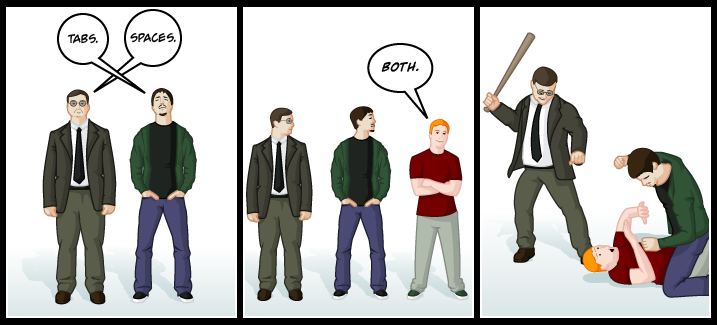

# General considerations

As we develop programs, it becomes mandatory for the sake of our sanity to
structure our source code by indenting logical blocks with an homogeneous
amount of whitespace.


// This is what a sane person would do
int main(void)
{
    if (42)
	puts("Don't panic, and carry a towel");
    return 0;
}

// Oh my god what is wrong with you?
int main(void)
{
if (42)
puts("Don't panic, and carry a towel");
return 0;
}


Among the grand family of programmers, we can observe two
schools of thought: those who indent with spaces, and those who indent with
tabulation characters ('\t', internally known as 0x09 for any self respecting
charset).

The choice of your school is usually a matter of style, but it is
nonetheless important to keep those principles in mind:

* Use one or the other, not both.

* Try to use the same style inside your team, of lest your source code becomes
  a nightmarish chimera.

* *never* use anything else than 8 as the length of your tab character ('\t').
  This is a de facto standard: a tab character means just enough whitespace to
  reach the next multiple of 8. Note that as we're talking about indentation
  and putting those tabs characters at the beginning of lines, we can simply
  consider that a tab character is defined here as a 8 characters symbol. What
  this implies is that if you join the *Church of the Holy Tab*, you vow to
  always indent by increments of 8, as any other value would mean mixing up
  tabs and spaces. You don't want that, do you?

* In this article we are talking about indentation, not variable alignment.
  While two schools of thought exists for indentation, most people agree on
  spaces being the only sane option for variable alignment (that is, assuming
  you want to align your variable names in the first place. Seriously, who does
  that outside of school?). Some people (me included) consider that this
  ultimately means mixing spaces and tabs, and that would be evil™, hence the
  choice of spaces only.

# Vim settings

Now that we're a bit clearer on the topic, let's see how to configure vim to
make if reflect our religious faith.

There are four vim options that define how the editor will behave towards
indentation:

* expandtab: If this option is set, pressing the Tab key will trigger the
  insertion of a certain amount of spaces instead of the '\t' character. (As
  with every vim option, you can explicitly disable it by prefixing it with
  no, e.g.: noexpandtab)

* tabstop: represents the length of the tab character ('\t'). As explained
  above, its default value is 8 and should never been changed. I'm only
  describing it for the sake of completude.

* softtabstop: represents the amount of spaces inserted upon pressing the Tab
  key, assuming expandtab is enabled. Its default value is 0, which effectively
  means deactivating the option.

* shiftwidth: represents the indentation level. Depending on the value of
  expandtab, vim will insert either spaces only, or a combination of both tabs
  and spaces (yuck!). Its default value is 8.

One important thing to note is that softtabstop and shiftwidth do not
necessarily share the same value. That is, pressing the Tab key doesn't always
insert the same amount of whitespace as the one automatically inserted via
vim's indentation mechanism. As i personally don't find that behaviour
desirable, I suggest setting shiftwidth to either 8, or the same value of
softtabstop, depending on your faith.

Hence, supporters of the *way of the space* shall configure their editor thusly:


set expandtab
set tabstop=8 ; The default behaviour, just for documentation
set softtabstop=n
set shiftwidth=n


With `n` being left to the reader's discretion (I personally like 4).

Meanwhile, *Chuch of the Holy Tab* zealots shall use the following
configuration:


set noexpandtab
set tabstop=8 ; Same thing, I'm only documenting the value
set softtabstop=0
set shiftwidth=8


Those lines are, as you can guess, to be inserted in your .vimrc.

# Filetype specific indentations

As I said earlier, the choice of you indentation religion is usually left to
you. Some languages though, have made that choice for you. make, for example,
expects tabs in your Makefile and simply won't work with spaces. Another
example is python, which while working perfectly fine with either, strongly
recommends the use of spaces with an indentation level of 4 in the Pep 8.

So what happens if we chose spaces and have to edit a Makefile? Fear not, for
vim can detect filetypes and override your options with suitable ones. That is,
of course, assuming you have this essential line in your .vimrc:


filetype plugin indent on


This line tells vim to try and detect the filetype of the files being edited,
and loads up filetype specific plugins and indentation rules. This is thanks to
that rule that we don't have to manually set the indentation type with cindent,
smartindent, lispindent, or whatever: it is automatically loaded upon filetype
detection.

Note that we can -- and should! -- still set the following option:


set autoindent


As it only sets up a poor man's indentation (i.e.: copies the indentation level
of the previous line) when a filetype hasn't been detected, as a fallback.

# Conclusion

Because every blog post ever should finish on an humorous note, here is a funny
image posted by `eph3mereal` on #vim@freenode:

